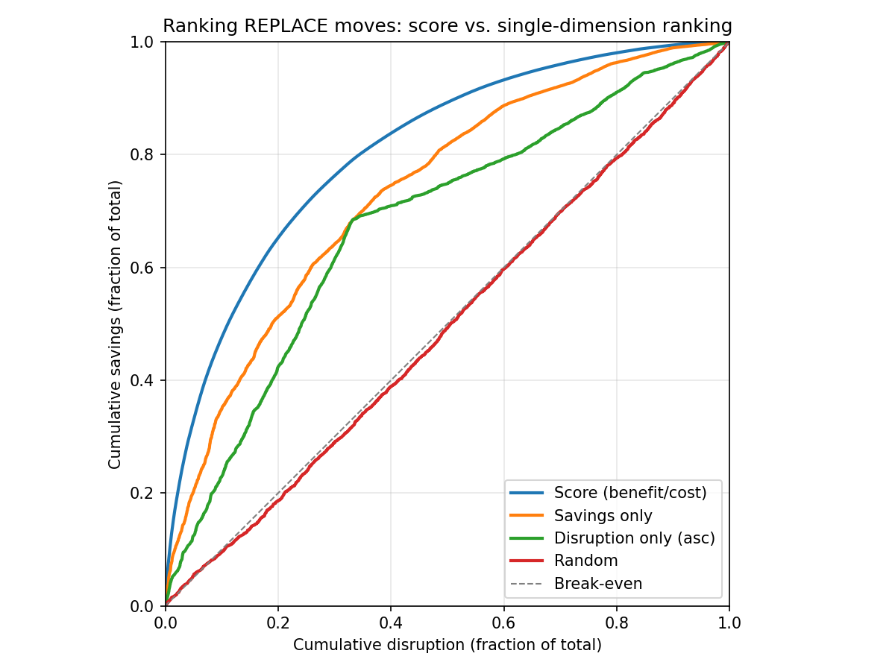
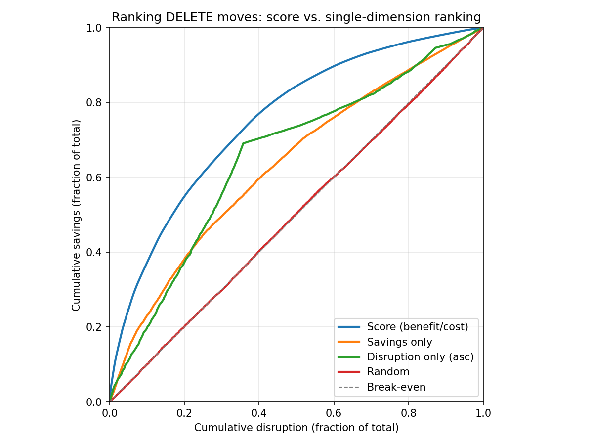

# WhenSavingsJustifyDisruption: Scoring Consolidation Moves

## Motivation

Today, Karpenter's consolidation is all-or-nothing. `WhenEmptyOrUnderutilized` consolidates any node where pods can be repacked more cheaply, regardless of how little is saved or how many pods are disrupted. `WhenEmpty` consolidates only nodes with no pods. A move that saves $0.02/day by evicting a pod with a 30-minute warm-up cache is treated the same as a move that saves $5/day by evicting a stateless proxy.

Consolidation happens when Karpenter can find a cost savings, and terminating an empty node that will not be used for future pods is an obviously good idea. But terminating a non-empty node requires starting up replacement pods and terminating running pods (pod disruption), ideally in that order. Customers report cases where the pod disruption is not worth the cost savings. Related issues:

- Nodes at 93-99% CPU utilization disrupted instead of lightly utilized ones ([aws#8868](https://github.com/aws/karpenter-provider-aws/issues/8868), [kubernetes-sigs#2319](https://github.com/kubernetes-sigs/karpenter/issues/2319))
- Multi-hour consolidation loops replacing the same instance types with no net savings ([aws#8536](https://github.com/aws/karpenter-provider-aws/issues/8536), [aws#6642](https://github.com/aws/karpenter-provider-aws/issues/6642), [aws#7146](https://github.com/aws/karpenter-provider-aws/issues/7146))
- Rapid node churn where consolidation deletes nodes that are immediately re-provisioned ([kubernetes-sigs#1019](https://github.com/kubernetes-sigs/karpenter/issues/1019), [kubernetes-sigs#735](https://github.com/kubernetes-sigs/karpenter/issues/735), [kubernetes-sigs#1851](https://github.com/kubernetes-sigs/karpenter/issues/1851))
- `consolidateAfter` not preventing disruption of well-packed nodes ([kubernetes-sigs#2705](https://github.com/kubernetes-sigs/karpenter/issues/2705), [aws#3577](https://github.com/aws/karpenter-provider-aws/issues/3577))
- Direct requests for a savings threshold or utilization-based consolidation gating ([kubernetes-sigs#2883](https://github.com/kubernetes-sigs/karpenter/issues/2883), [kubernetes-sigs#1440](https://github.com/kubernetes-sigs/karpenter/issues/1440), [kubernetes-sigs#1686](https://github.com/kubernetes-sigs/karpenter/issues/1686), [kubernetes-sigs#1430](https://github.com/kubernetes-sigs/karpenter/issues/1430), [aws#5218](https://github.com/aws/karpenter-provider-aws/issues/5218))

This RFC characterizes individual actions taken by consolidation as *moves*. A move proposes deleting one or more nodes, along with any necessary pod disruption and replacement node creation. We propose a new `consolidationPolicy` value, `WhenSavingsJustifyDisruption`, that scores each move and rejects moves where the disruption outweighs the savings. At launch, `WhenSavingsJustifyDisruption` is opt-in. After user feedback, we will consider making it the default, replacing `WhenEmptyOrUnderutilized`.

## Proposal

### Proposed Spec

```yaml
apiVersion: karpenter.sh/v1
kind: NodePool
metadata:
  name: default
spec:
  disruption:
    consolidationPolicy: WhenSavingsJustifyDisruption
    consolidateAfter: 30s
    budgets:
    - nodes: 10%
```

A move is approved only when the fraction of NodePool cost saved is at least as large as the fraction of NodePool disruption incurred (score >= 1.0).

Each move has a cost savings and a disruption cost. Cost savings is the difference between the cost of candidate and replacement nodes. Disruption cost for the move is the sum of per-pod disruption costs, computed by the existing [`EvictionCost`](../pkg/utils/disruption/disruption.go) function. This function combines the standard Kubernetes `controller.kubernetes.io/pod-deletion-cost` annotation with pod scheduling priority. Pods that are expensive to restart naturally resist consolidation.

Both savings and disruption are expressed as fractions of their NodePool totals before being compared. This normalization makes both sides dimensionless. A move saving 10% of a $50/day pool's cost is equivalent to a move saving 10% of a $5,000/day pool's cost. Similarly, disrupting 4 pods out of 40 (10%) is equivalent to disrupting 400 pods out of 4000 (10%). All else being equal, a move with 2% savings fraction and 1% disruption fraction (score 2.0) is strictly better than a move with 2% savings fraction and 3% disruption fraction (score 0.67).

`WhenSavingsJustifyDisruption` is a new `consolidationPolicy` enum value. We believe this behavior is strictly better than `WhenEmptyOrUnderutilized` for most workloads, but we want feedback from opt-in users before making it the Karpenter-wide default. The default remains `WhenEmptyOrUnderutilized` (no behavior change for existing users). Operators opt in by setting `consolidationPolicy: WhenSavingsJustifyDisruption` on their NodePool.

### How Scoring Works

#### Intuition

Consider a move that saves $4.84/day by draining an m7i.xlarge and disrupts 4 pods. Is this a good move? First, we need to decide locally whether the move is worth doing at all in isolation. Then, if it passes, we need to decide whether the move is worth doing *now* given PodDisruptionBudgets, NodePool disruption budgets, and the NodePool's `consolidateAfter` delay. The score answers the first question.

On a NodePool costing $48.40/day with 40 pods, you save 10% of cost for 10% of disruption. On a NodePool costing $4,840/day with 4000 pods, you save 0.1% of cost for 0.1% of disruption. Both score 1.0 despite very different absolute numbers. But saving 0.1% of cost for 10% of disruption scores 0.01 and fails the break-even threshold by 100x.

For cross-NodePool consolidation, the source NodePool's total dollar cost, total disruption cost, and consolidation policy govern the decision to accept or reject the move. Cross-pool moves may be DELETEs (source node removed, pods land on existing capacity in another pool) or REPLACEs (source node removed, replacement node created in the source pool). In either case, the dollar cost savings comes from the difference between the source nodes (priced by the source NodePool) and any replacement nodes (priced by their respective NodePools).

#### Calculation

```
savings = sum(deleted_node.price) - sum(created_node.price)
disruption_cost = sum(max(0, EvictionCost(pod)) for pod in moved_pods)

savings_fraction = savings / nodepool_total_cost
disruption_fraction = disruption_cost / nodepool_total_disruption_cost

score = savings_fraction / disruption_fraction
```

A move is approved when `score >= 1.0`. A score of 1.0 is break-even: savings fraction equals disruption fraction. Higher scores indicate better value per unit of disruption. When comparing moves, the log2 scale gives scores symmetric dynamic range: +1 means the move saves 2x more cost fraction than disruption fraction, -1 means 2x worse.

**Division-by-zero handling.** If `disruption_cost` is zero (no pods, or all pods have zero disruption cost), then `disruption_fraction` is zero. DELETE operations with zero disruption cost are approved if savings are non-negative, similar to what `WhenEmpty` does for empty nodes. REPLACE operations with zero disruption cost are approved if savings are positive. If `nodepool_total_disruption_cost` is zero, any move with positive savings is approved, matching `WhenEmptyOrUnderutilized`. If `nodepool_total_cost` is zero, `savings_fraction` is undefined and no consolidation happens. See [Edge Cases](#edge-cases) for worked examples.

#### Move Score Determines Move Order

When multiple moves pass the threshold and a disruption budget limits how many can execute, we also use the score to determine execution order. Ranking by benefit/cost ratio is a strong heuristic in general and is optimal for the fractional knapsack problem.





The graphs above show REPLACE and DELETE moves generated from a simulated cluster. The simulation builds a cluster by placing 5000 pods with log-normal resource requests onto c7i, m7i, and r7i instance types via first-fit-decreasing bin-packing, then runs 10 rounds of workload churn (killing 0-80% of each node's pods and adding new pods with different shapes). REPLACE moves reprovision each node's remaining pods on the cheapest fitting instance type. DELETE moves scatter a node's pods onto existing spare capacity. Each curve shows cumulative savings (y-axis) as a function of cumulative disruption (x-axis) under a different ranking strategy. The diagonal is break-even. Ranking by score dominates: at every disruption level, it delivers more savings than ranking by savings alone, disruption alone, or randomly. The script to reproduce these charts is in [`designs/scripts/ranking-strategies.py`](scripts/ranking-strategies.py).

#### Calculating Per-Pod Disruption Cost

`EvictionCost` in `pkg/utils/disruption/disruption.go` starts with a base of 1.0 per pod and adds two terms:

1. **`controller.kubernetes.io/pod-deletion-cost` annotation**, divided by 2^27, contributing roughly -16 to +16. Karpenter uses this annotation to determine which nodes are cheaper to disrupt: nodes whose pods have lower deletion costs are preferred as consolidation candidates.
2. **Pod scheduling priority**, divided by 2^25, contributing roughly -64 to +30 for standard priority classes. Priority serves a similar role: higher-priority pods increase their node's disruption cost, making that node less attractive for consolidation. The two terms differ in intent -- pod-deletion-cost is an explicit opt-in signal from the pod author, while priority is an existing Kubernetes scheduling concept -- but both contribute additively to the same disruption cost.

The result of the `EvictionCost` function is clamped to [-10, 10]. For calculating per-pod disruption cost for this RFC, we clamp negative values to 0, because a negative disruption cost would invert the ratio. This gives an effective per-pod range of [0, 10] with a default of 1.0 for pods with no annotation and default priority.

Pod authors can set a high `controller.kubernetes.io/pod-deletion-cost` to resist consolidation. Priority classes resist consolidation automatically through the priority term.

#### NodePool Totals

```
nodepool_cost = sum(node.price for node in nodepool.nodes)
nodepool_total_disruption_cost = sum(node.disruption_cost for node in nodepool.nodes)
```

Each node's disruption cost is the sum of `max(0, EvictionCost(pod))` for its pods.

### Examples

> **[Interactive Calculator](consolidation-calculator.html)** — plug in your own NodePool shape and see which moves pass.

All examples use a NodePool with 10 nodes: eight m7i.xlarge (4 vCPU, 16 GiB, $4.84/day) and two m7i.2xlarge (8 vCPU, 32 GiB, $9.68/day). Total NodePool cost is $58.08/day. The NodePool runs 80 pods with total disruption cost 80.

#### Oversized Node (approved)

One m7i.2xlarge runs 3 pods requesting 1.5 vCPU and 6 GiB total. Disruption cost is 3. These pods fit on an m7i.large at $2.42/day. Savings is $7.26.

```
savings_fraction  = 7.26 / 58.08  = 12.5%
disruption_fraction = 3 / 80      =  3.75%
score             = 0.125 / 0.0375 =  3.33  > 1.0  --> approved
```

#### Spare Capacity Delete (approved)

One m7i.xlarge runs 4 pods requesting 1.5 vCPU and 6 GiB. Disruption cost is 4. Another node has spare capacity. Savings is $4.84 (full node cost, no replacement needed).

```
savings_fraction  = 4.84 / 58.08  =  8.3%
disruption_fraction = 4 / 80      =  5.0%
score             = 0.083 / 0.05  =  1.67  > 1.0  --> approved
```

#### Marginal Move (rejected)

One m7i.xlarge runs 8 pods requesting 1.8 vCPU and 7 GiB. Disruption cost is 8. The pods fit on an m7i.large at $2.42/day. Savings is $2.42.

```
savings_fraction  = 2.42 / 58.08  =  4.2%
disruption_fraction = 8 / 80      = 10.0%
score             = 0.042 / 0.10  =  0.42  < 1.0  --> rejected
```

#### Well-Packed Node (rejected)

One m7i.xlarge runs 10 pods requesting 3.5 vCPU and 14 GiB. The smallest fitting replacement is another m7i.xlarge. Savings is $0. No threshold approves this move.

#### Scale Invariance

The same oversized-node scenario on a 100-node NodePool ($580.80/day total cost, 800 total disruption cost) produces the same score:

```
savings_fraction  = 7.26 / 580.80  = 1.25%
disruption_fraction = 3 / 800      = 0.375%
score             = 0.0125 / 0.00375 = 3.33
```

The break-even threshold produces the same decision regardless of NodePool size.

#### Disruption Cost Invariance

The Spare Capacity Delete above uses default per-pod disruption cost of 1 (total disruption cost 80). If every pod instead has disruption cost 10 (total disruption cost 800):

```
savings_fraction  = 4.84 / 58.08  =  8.3%
disruption_fraction = 40 / 800    =  5.0%
score             = 0.083 / 0.05  =  1.67
```

The score is identical. Uniform disruption cost cancels in the ratio: `(n * k) / (N * k) = n / N`. The score only differentiates pods when their disruption costs differ. Setting every pod to the same value — whether 1 or 10 — has no effect on any score.

#### Cross-NodePool: On-Demand and Spot

A cluster has two NodePools. The On-Demand pool has 10 m7i.xlarge nodes at $4.84/day each ($48.40/day total, 80 pods, total disruption cost 80). The Spot pool has 10 m7i.xlarge nodes at $1.45/day each ($14.50/day total, 80 pods, total disruption cost 80).

One node in each pool runs 3 pods requesting 1 vCPU. Disruption cost is 3. The pods can be absorbed by other nodes. This is a DELETE of the source node.

**On-Demand pool DELETE:**

```
savings_fraction  = 4.84 / 48.40  = 10.0%
disruption_fraction = 3 / 80      =  3.75%
score             = 0.10 / 0.0375 =  2.67  > 1.0  --> approved
```

**Spot pool DELETE:**

```
savings_fraction  = 1.45 / 14.50  = 10.0%
disruption_fraction = 3 / 80      =  3.75%
score             = 0.10 / 0.0375 =  2.67  > 1.0  --> approved
```

Both moves score identically because each node represents the same fraction of its pool's cost and disrupts the same fraction of its pool's pods.

If the Spot pool node instead runs 8 pods with disruption cost 8:

```
savings_fraction  = 1.45 / 14.50  = 10.0%
disruption_fraction = 8 / 80      = 10.0%
score             = 0.10 / 0.10   =  1.0   = 1.0  --> approved (at break-even)
```

The move barely passes. Increasing disruption cost on any pod would push it below break-even.

### Edge Cases

#### Zero Total Disruption Cost

If a node has no pods (or all its pods have disruption cost 0), the move's `disruption_cost` is zero and `disruption_fraction` is zero. The implementation treats zero disruption fraction as: approve if savings are positive.

If the entire NodePool's `nodepool_total_disruption_cost` is zero, any move with positive savings is approved, matching `WhenEmptyOrUnderutilized`.

#### Zero-Cost Nodes (ODCRs, Reserved Capacity)

If a node's cost is zero (ODCR, reserved instance, or static capacity), the savings from deleting it are zero. The score is zero and the node is never consolidated. If the entire NodePool has zero total cost, `savings_fraction` produces a division by zero. The implementation treats this as no consolidation.

When a positive-cost source node is consolidated and its pods land on a zero-cost destination node, this is a DELETE from the source pool's perspective. A move that deletes a $4.84/day On-Demand node whose pods land on an ODCR node scores the same as if they landed on another On-Demand node with spare capacity.

If an entire NodePool is zero-cost, no consolidation happens. Operators who want to consolidate zero-cost capacity for non-financial reasons (reducing node count, simplifying topology) can use `WhenEmptyOrUnderutilized`.

### Candidate Filtering

Generating consolidation moves is expensive. For each candidate source node, the system must find a destination, compute replacement node costs, and verify scheduling constraints.

For single-node moves, a node's delete ratio provides a cheap upper bound on the score. Deleting reclaims the full cost of the source node. A replace reclaims less, because a replacement node is created. The disruption cost is the same either way.

```
delete_ratio = (node.price / nodepool_cost) / (node.disruption_cost / nodepool_total_disruption_cost)
```

If a node's delete ratio falls below the threshold, no single-node move from that node can clear the threshold. The system can skip move generation for that node.

For multi-node consolidation (drain N nodes, create 1 replacement), the combined score depends on all nodes in the batch. A node with a low individual delete ratio could participate in a passing batch if other nodes contribute enough savings. The delete ratio filter cannot be applied to individual nodes without risking false negatives, so it applies only to single-node moves. For multi-node consolidation, all candidates proceed to full move generation and scoring.

### Interaction with Existing Features

Scoring determines which moves are *worth doing*. All existing feasibility checks still apply: NodePool disruption budgets, PodDisruptionBudgets, `consolidateAfter`, and `karpenter.sh/do-not-disrupt`. Scoring applies only to voluntary consolidation decisions. Spot interruptions and other involuntary disruptions are not gated by the score.

## API Choices

### Consolidation Aggressiveness Tuning [Recommended: Fixed Break-Even at Launch]

This proposal ships a fixed break-even threshold (score >= 1.0) with no operator-facing aggressiveness knob. The behavior is equivalent to a slider value of 50 in the alternatives below, so any extension is non-breaking.

The break-even threshold has a clear meaning: don't disrupt a larger share of the NodePool than the share of cost you save. Users who need different aggressiveness across workloads can use `controller.kubernetes.io/pod-deletion-cost` and pod priority. This keeps the cost-disruption tradeoff with application developers, who know which pods are expensive to restart, rather than cluster operators, who often do not.

Two alternatives were considered for operator-level aggressiveness control:

**Low/Medium/High (three-state).** A `consolidationAggressiveness` field with three values: Low (conservative, equivalent threshold ~3.16), Medium (break-even, threshold 1.0), High (aggressive, equivalent threshold ~0.32). Each step is a 10x change in required savings-per-disruption. This avoids the "what number do I pick?" problem of a continuous range. Not preferred at launch, but this is the most likely extension if users demonstrate a need for NodePool-level tuning beyond per-pod annotations.

**Continuous slider (0-100).** A `consolidationThreshold` field (0-100) mapping to a log-scale threshold via `10^((x-50)/25)`, where 0 means consolidate aggressively (threshold 0.01), 50 is break-even (threshold 1.0), and 100 means consolidate only for extreme savings (threshold 100). Each 25-point increment is a 10x change. 0-100 is a wide range with no guidance on what value to pick. This is the most extreme alternative considered.

Pros: Zero configuration. Clear meaning. Shifts tuning to per-pod annotations where domain knowledge lives. Both alternatives can be added later as non-breaking extensions.

Cons: Operators who want a NodePool-level aggressiveness knob must wait. Cannot express "consolidate aggressively on my batch NodePool" without per-pod annotations.

### Per-NodePool vs. Per-Cluster Normalization [Recommended: Per-NodePool]

The score denominators (total cost, total disruption cost) could be computed per-NodePool or across the entire cluster. This proposal recommends per-NodePool.

Per-NodePool normalization keeps scores meaningful at the scope operators configure. A 1000-node batch pool and a 10-node stateful pool have different cost structures. Per-cluster normalization would dilute the stateful pool's scores: a single node representing 10% of its own pool becomes 0.1% of the cluster. Per-NodePool also matches Karpenter's existing architecture -- consolidation policies, budgets, and `consolidateAfter` are already per-NodePool.

Pros: Matches Karpenter's per-NodePool architecture. Prevents large pools from diluting small pool scores. Each pool's operator controls its own cost-disruption tradeoff.

Cons: Cannot directly compare scores across pools (but no current feature needs this).

### New consolidationPolicy Value vs. New Field

Adding `WhenSavingsJustifyDisruption` as a policy value keeps the new behavior gated behind an explicit opt-in.

Pros: No behavior change for existing users. Clear migration path: change `WhenEmptyOrUnderutilized` to `WhenSavingsJustifyDisruption`.

Cons: Another enum value to document.

## Alternatives Considered

### Cost Improvement Factor

Require a minimum price improvement ratio (e.g., old_price / new_price >= 2, meaning the replacement must cost less than half the original). Considered for spot consolidation ([spot-consolidation.md](https://github.com/kubernetes-sigs/karpenter/blob/main/designs/spot-consolidation.md)). A move that saves 50% of a node's cost but disrupts 20 high-cost pods would pass a 2x price improvement factor. The right outcome is rejection. The improvement factor cannot distinguish this from a 50% savings move that disrupts 2 default-cost pods, because it ignores disruption entirely. The normalized score rejects the first (high disruption fraction exceeds savings fraction) and approves the second.

### Absolute Dollar Threshold

Require savings to exceed a fixed dollar amount (e.g., $1/day). Consider two moves that each save $1/day and disrupt 4 default-cost pods. On a $50/day NodePool with 40 pods, this saves 2% of cost for 10% of disruption. The right outcome is rejection. On a $5,000/day NodePool with 4000 pods, the same $1 saves 0.02% of cost for 0.1% of disruption. The right outcome is still rejection. A $1 threshold approves both. The normalized score rejects both because the disruption fraction exceeds the savings fraction.

### Utilization-Based Threshold

Exclude nodes above a resource utilization percentage (e.g., 70%) from consolidation, like CA's `scale-down-utilization-threshold` ([kubernetes-sigs#1686](https://github.com/kubernetes-sigs/karpenter/issues/1686), [aws#5218](https://github.com/aws/karpenter-provider-aws/issues/5218)). This is the most frequently requested alternative. Consider a node at 40% utilization running one pod with `pod-deletion-cost: 2147483647` (a model-serving pod with a 2-hour warm-up cache). The right outcome is rejection. A 70% utilization threshold approves the move because 40% < 70%. A node at 40% running ten stateless pods should be approved, but the utilization threshold treats both identically. The normalized score rejects the first (the pod's high disruption cost dominates the disruption fraction) and approves the second.

### Selective Consolidation Type Disable

Disable single-node consolidation (replace) while keeping multi-node and emptiness consolidation ([kubernetes-sigs#1430](https://github.com/kubernetes-sigs/karpenter/issues/1430), [kubernetes-sigs#684](https://github.com/kubernetes-sigs/karpenter/issues/684), [PR #1433](https://github.com/kubernetes-sigs/karpenter/pull/1433)). Consider an m7i.2xlarge ($9.68/day) running 2 pods requesting 2 vCPU total. The right outcome is a replace to an m7i.large ($2.42/day), saving $7.26/day for 2 pods of disruption. Disabling replace blocks this move along with every other replace. The normalized score approves this replace (high savings fraction, low disruption fraction) while rejecting a replace that saves $0.50 by moving 8 pods.

### Separate Disruption Cost Annotation

A dedicated `karpenter.sh/disruption-cost` annotation separate from the existing `EvictionCost` inputs. This would let application developers independently control eviction ordering and consolidation gating. The existing `controller.kubernetes.io/pod-deletion-cost` and pod priority already express the same intent. A separate annotation could be introduced later if eviction ordering and consolidation gating need to diverge.

### Related Work

- [PR #2562](https://github.com/kubernetes-sigs/karpenter/pull/2562): `ConsolidationPriceImprovementFactor` field (0.0-1.0) with operator-level default and NodePool override. Cost Improvement Factor with a different UX.
- [PR #2893](https://github.com/kubernetes-sigs/karpenter/pull/2893): Decision ratio with a configurable `DecisionRatioThreshold` (default 1.0). Same scoring approach as this RFC but exposes the threshold from day one.
- [PR #2901](https://github.com/kubernetes-sigs/karpenter/pull/2901): External health signal probes on NodePools that block disruption when a probe fails. Orthogonal and complementary.
- [PR #2894](https://github.com/kubernetes-sigs/karpenter/pull/2894): Controller that automatically manages `controller.kubernetes.io/pod-deletion-cost` based on pluggable ranking strategies. Complementary; would automate disruption cost inputs.

## Backward Compatibility

- `WhenEmptyOrUnderutilized` and `WhenEmpty` are unchanged. Existing NodePool specs continue to work.
- Per-pod disruption cost is computed from the existing `controller.kubernetes.io/pod-deletion-cost` annotation and pod priority via `EvictionCost`. Pods without these inputs default to disruption cost 1.0, matching current behavior (all pods are equal).

## Future Work

### Configurable Aggressiveness

If operators demonstrate a need for per-NodePool aggressiveness tuning beyond what per-pod annotations provide, a Low/Medium/High `consolidationAggressiveness` field is the most likely extension. A continuous 0-100 slider is possible but less likely. The fixed break-even threshold is equivalent to Medium (or slider value 50), so either extension is non-breaking. See [API Choices](#consolidation-aggressiveness-tuning-recommended-fixed-break-even-at-launch) for details.

### Move Prioritization

When multiple moves pass the threshold, prioritize by score. Higher-scoring moves deliver more savings per disruption. This interacts with disruption budgets: if the budget allows three concurrent moves, pick the three highest-scoring moves.

### Move Quality Tracking

Annotate each moved pod with the consolidation move's score. Track how many moved pods are re-disrupted before savings are realized (e.g., the pod is evicted again within minutes). A high rate of premature re-disruption indicates the threshold is too aggressive. A low rate with many moves rejected indicates it may be too conservative.

### Async Move Generation and Execution

Cost scoring enables a shift from synchronous per-cycle consolidation to a continuous async pipeline. A background worker can generate candidate moves, score them, enqueue them by priority, and execute them as budget allows. Moves are re-validated before execution. This architecture eliminates the per-cycle timeout problem.

### Scoring Observability

Surface the move count and estimated savings at the current threshold. Scoring a representative sample of moves shows operators how many moves would pass.

## Frequently Asked Questions

### What happens in a uniformly inefficient cluster where no single move clears the threshold?

If every node is slightly underutilized by a similar amount, each individual move produces a small savings fraction relative to its disruption fraction, and no move reaches `score >= 1.0`. This is by design: the cost threshold is conservative and rejects moves where the disruption is not clearly justified.

A complementary acceptance criterion addresses this case. A move is accepted if **either** (a) it clears the cost threshold (`score >= 1.0`), **or** (b) the destination state costs no more than what the provisioner would produce if it placed the affected pods on fresh capacity from scratch. Criterion (b) says: "this move reaches provisioning-quality packing, so the result is at least as good as starting over." DELETE moves trivially pass criterion (b) because removing a node is always at least as cheap as provisioning a new one for those pods. REPLACE moves pass when the replacement node costs no more than the provisioner's cheapest feasible selection.

This dual criterion eliminates the need for iterative re-evaluation (accept best move, re-score all remaining, repeat). A move either clears the cost threshold or matches provisioning quality. If it does neither, it is correctly rejected. The provisioning-equivalence criterion is proposed in a separate RFC.

### Does the score account for kube-scheduler pod placement?

No. The score evaluates the consolidation move as proposed: source nodes are deleted, replacement nodes (if any) are created, and moved pods are assumed to land on the intended destination. In practice, kube-scheduler may place pods on different nodes than Karpenter expects. If pods scatter across existing nodes instead of packing onto the replacement, the replacement may be underutilized, triggering another consolidation cycle.

This is an existing limitation of Karpenter's consolidation, not introduced by scoring. `WhenEmptyOrUnderutilized` has the same gap. The cost threshold reduces the frequency of this problem by rejecting marginal moves that are most likely to produce churn, but it does not eliminate it. Closing the gap between Karpenter's placement assumptions and kube-scheduler's actual decisions is complementary work.

### What disruption budgets does scoring respect?

All of them. Scoring determines which moves are *worth doing*. Budgets determine which moves are *allowed*. Both must pass. NodePool disruption budgets (`spec.disruption.budgets`), PodDisruptionBudgets, `consolidateAfter`, and `karpenter.sh/do-not-disrupt` all apply unchanged. When multiple moves pass the threshold, they are ranked by score and the highest-scoring moves execute first within budget.

### Why doesn't the score account for reserved instance or ODCR opportunity cost?

Zero-cost nodes produce zero savings and are never consolidated. This is correct within the RFC's cost model, which uses the financial cost reported by the cloud provider. Reserved capacity has real opportunity cost, but modeling it requires expressing what freed capacity is worth, which varies by organization and time horizon. This RFC defers opportunity-cost modeling. Operators who want to consolidate zero-cost capacity can use `WhenEmptyOrUnderutilized`.

Karpenter does not currently have access to the amortized hourly cost of reservations (purchase price / term / hours). Surfacing amortized cost would require billing API integration (e.g., AWS Cost Explorer), which is out of scope.

### Where is the score visible?

Scored moves are logged at DEBUG level with score, savings fraction, disruption fraction, source node(s), and decision. A Prometheus histogram (`karpenter_consolidation_score`) records scores partitioned by decision and NodePool. The score is also surfaced as an event on the NodeClaim (`kubectl describe nodeclaim`).

### Which NodePool governs a cross-NodePool consolidation move?

The source NodePool (the one that owns the candidate node). Its policy, threshold, total cost, and total disruption cost are used for normalization. The destination pool's settings are not relevant.

### Will this become the default consolidation policy?

Not at launch. `WhenSavingsJustifyDisruption` is opt-in behind a feature gate. Whether it becomes the default is a community decision deferred to GA graduation.

### Does constraining maximum node size improve this proposal?

Smaller nodes mean smaller disruption fractions per move, making it easier for moves to clear the threshold. The formula works correctly regardless of node size, but clusters with very large nodes (50+ pods) will see more rejections. This is complementary work. Operators can manage node size through NodePool instance-type constraints today.

## Rollout

This feature follows Karpenter's standard feature gate pattern, consistent with SpotToSpotConsolidation and NodeOverlay.

### Phase 1: Alpha (feature gate, disabled by default)

`WhenSavingsJustifyDisruption` is gated behind a `SavingsBasedConsolidation` feature gate, disabled by default. Setting `consolidationPolicy: WhenSavingsJustifyDisruption` without the gate enabled is rejected by validation. Operators opt in via `--feature-gates SavingsBasedConsolidation=true`.

Each scored move is logged at DEBUG level with the score, savings fraction, disruption fraction, source node(s), and decision (approved/rejected). A Prometheus metric (`karpenter_consolidation_score`) records a histogram of move scores, partitioned by decision and NodePool.

### Phase 2: Beta (feature gate, enabled by default)

After community feedback confirms the break-even threshold works across diverse workloads, the feature gate defaults to enabled. Operators who encounter issues can disable it.

### Phase 3: GA (feature gate removed)

The feature gate is removed. `WhenSavingsJustifyDisruption` is always available without a gate. Whether it becomes the default policy is a separate community decision. Existing NodePool specs are unaffected.

Graduation is community-driven based on adoption, GitHub issues, and real-world feedback.
