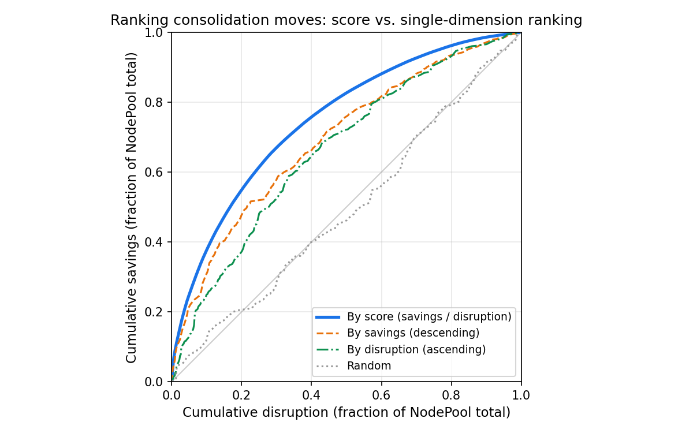

# WhenSavingsJustifyDisruption: Scoring Consolidation Moves

## Motivation

Today, Karpenter's consolidation is all-or-nothing. `WhenEmptyOrUnderutilized` consolidates any node where pods can be repacked more cheaply, regardless of how little is saved or how many pods are disrupted. `WhenEmpty` consolidates only nodes with no pods. A move that saves $0.02/day by evicting a pod with a 30-minute warm-up cache is treated the same as a move that saves $5/day by evicting a stateless proxy.

Consolidation happens when Karpenter can find a cost savings, and terminating an empty node that will not be used for future pods is an obviously good idea. But terminating a non-empty node requires starting up replacement pods and terminating running pods (pod disruption), ideally in that order. Customers report cases where the pod disruption is not worth the cost savings. Related issues:

- Nodes at 93-99% CPU utilization disrupted instead of lightly utilized ones ([aws#8868](https://github.com/aws/karpenter-provider-aws/issues/8868), [kubernetes-sigs#2319](https://github.com/kubernetes-sigs/karpenter/issues/2319))
- Multi-hour consolidation loops replacing the same instance types with no net savings ([aws#8536](https://github.com/aws/karpenter-provider-aws/issues/8536), [aws#6642](https://github.com/aws/karpenter-provider-aws/issues/6642), [aws#7146](https://github.com/aws/karpenter-provider-aws/issues/7146))
- Rapid node churn where consolidation deletes nodes that are immediately re-provisioned ([kubernetes-sigs#1019](https://github.com/kubernetes-sigs/karpenter/issues/1019), [kubernetes-sigs#735](https://github.com/kubernetes-sigs/karpenter/issues/735), [kubernetes-sigs#1851](https://github.com/kubernetes-sigs/karpenter/issues/1851))
- `consolidateAfter` not preventing disruption of well-packed nodes ([kubernetes-sigs#2705](https://github.com/kubernetes-sigs/karpenter/issues/2705), [aws#3577](https://github.com/aws/karpenter-provider-aws/issues/3577))
- Direct requests for a savings threshold or utilization-based consolidation gating ([kubernetes-sigs#2883](https://github.com/kubernetes-sigs/karpenter/issues/2883), [kubernetes-sigs#1440](https://github.com/kubernetes-sigs/karpenter/issues/1440), [kubernetes-sigs#1686](https://github.com/kubernetes-sigs/karpenter/issues/1686), [kubernetes-sigs#1430](https://github.com/kubernetes-sigs/karpenter/issues/1430), [aws#5218](https://github.com/aws/karpenter-provider-aws/issues/5218))

This RFC characterizes individual actions taken by consolidation as *moves*. A move proposes deleting one or more nodes, along with any necessary pod disruption and replacement node creation. We propose a new `consolidationPolicy` value, `WhenSavingsJustifyDisruption`, that scores each move and rejects moves where the disruption outweighs the savings. At launch, `WhenSavingsJustifyDisruption` is opt-in. After user feedback, we will consider making it the default, replacing `WhenEmptyOrUnderutilized`.

## Proposal

### Proposed Spec

```yaml
apiVersion: karpenter.sh/v1
kind: NodePool
metadata:
  name: default
spec:
  disruption:
    consolidationPolicy: WhenSavingsJustifyDisruption
    consolidateAfter: 30s
    budgets:
    - nodes: 10%
```

`WhenSavingsJustifyDisruption` is a new `consolidationPolicy` enum value. The default remains `WhenEmptyOrUnderutilized`. Operators opt in per-NodePool.

### How Scoring Works

Each move has a cost savings and a disruption cost. The score compares these as fractions of NodePool totals.

#### Per-Pod Disruption Cost

[`EvictionCost`](../pkg/utils/disruption/disruption.go) in `pkg/utils/disruption/disruption.go` starts with a base of 1.0 per pod and adds two terms:

1. **Pod deletion cost** ([`controller.kubernetes.io/pod-deletion-cost`](https://kubernetes.io/docs/concepts/workloads/controllers/replicaset/#pod-deletion-cost) annotation), divided by 2^27, contributing roughly -16 to +16. This is a standard Kubernetes annotation set on the pod spec. The ReplicaSet controller uses it to choose which pods to remove first when scaling down: pods with lower deletion cost are deleted first. Karpenter reuses this annotation to determine which nodes are cheaper to disrupt.
2. **Pod priority**, divided by 2^25, contributing roughly -64 to +30 for standard priority classes. Priority is assigned to a pod via `spec.priorityClassName`, which references a cluster-wide [PriorityClass](https://kubernetes.io/docs/concepts/scheduling-eviction/pod-priority-preemption/) object. Kubernetes uses priority for two things: preemption (higher-priority pods can displace lower-priority pods to get scheduled) and node-pressure eviction (lower-priority pods are evicted first when a node runs out of memory). Karpenter reuses priority as a disruption cost signal: higher-priority pods increase their node's disruption cost. The two terms differ in who sets them. Pod-deletion-cost is set by pod authors. Priority is assigned by cluster operators via PriorityClass. Both contribute additively to the same disruption cost.

`EvictionCost` clamps the result to [-10, 10]. For scoring, we further clamp negative values to 0 because a negative disruption cost would invert the ratio. This gives disruption cost a per-pod range of [0, 10], with a default of 1.0 for pods with no annotation and default priority.

#### NodePool Totals

The score normalizes savings and disruption against NodePool totals: what fraction of the NodePool's cost does this move save, and what fraction of the NodePool's disruption does it incur?

```
nodepool_cost = sum(node.price for node in nodepool.nodes)
nodepool_total_disruption_cost = sum(node.disruption_cost for node in nodepool.nodes)
```

Each node's disruption cost is the sum of `max(0, EvictionCost(pod))` for its pods.

The totals only need to be sensible relative to each other. It would be consistent with this proposal to cache NodePool totals or to estimate them from a subset of nodes, as long as cost and disruption are estimated from the same sample.

For cross-NodePool consolidation, the source NodePool's total dollar cost, total disruption cost, and consolidation policy govern the decision to accept or reject the move. Cross-pool moves may be DELETEs (source node removed, pods land on existing capacity in another pool) or REPLACEs (source node removed, replacement node created in the source pool). In either case, the dollar cost savings comes from the difference between the source nodes (priced by the source NodePool) and any replacement nodes (priced by their respective NodePools).

#### Calculation

```
savings = sum(deleted_node.price) - sum(created_node.price)
disruption_cost = sum(max(0, EvictionCost(pod)) for pod in moved_pods)

savings_fraction = savings / nodepool_total_cost
disruption_fraction = disruption_cost / nodepool_total_disruption_cost

score = savings_fraction / disruption_fraction
```

A move is approved when `score >= 1.0`, meaning the savings fraction is at least as large as the disruption fraction. Higher scores indicate better value per unit of disruption.

**Division-by-zero handling.** If `disruption_cost` is zero (no pods, or all pods have zero disruption cost), `disruption_fraction` is zero. DELETE operations with zero disruption cost are approved if savings are non-negative. REPLACE operations with zero disruption cost are approved if savings are positive. If `nodepool_total_disruption_cost` is zero, any move with positive savings is approved. If `nodepool_total_cost` is zero, `savings_fraction` is undefined and no consolidation happens. See [Edge Cases](#edge-cases) for worked examples.

Feasibility checks (PodDisruptionBudgets, `karpenter.sh/do-not-disrupt`, scheduling constraints) filter which moves can be generated. Scoring evaluates which feasible moves are worth executing. Disruption budgets and `consolidateAfter` gate when and how many moves execute.

#### Why Normalize

Both savings and disruption are expressed as fractions of their NodePool totals. This makes both sides dimensionless. A move saving 10% of a $50/day pool's cost is equivalent to a move saving 10% of a $5,000/day pool's cost. Disrupting 4 pods out of 40 (10%) is equivalent to disrupting 400 pods out of 4000 (10%). A move with 2% savings fraction and 1% disruption fraction (score 2.0) is strictly better than a move with 2% savings fraction and 3% disruption fraction (score 0.67).

Consider a move that saves $4.84/day by draining an m7i.xlarge and disrupts 4 pods. On a NodePool costing $48.40/day with 40 pods, you save 10% of cost for 10% of disruption. On a NodePool costing $4,840/day with 4000 pods, you save 0.1% of cost for 0.1% of disruption. Both score 1.0 despite very different absolute numbers. But saving 0.1% of cost for 10% of disruption scores 0.01 and fails the threshold by 100x.

#### Move Score Determines Move Order

When multiple moves pass the threshold and a disruption budget limits how many can execute, we also use the score to determine execution order. Ranking by benefit/cost ratio is a strong heuristic in general and is [optimal for the fractional knapsack problem](https://en.wikipedia.org/wiki/Continuous_knapsack_problem#Solution).



The graphs above show REPLACE and DELETE moves generated from a simulated cluster. The simulation generates 5000 pods with random CPU and memory requests drawn from log-normal distributions (most pods are small, with a long tail of large pods). CPU and memory are drawn independently, so some pods are compute-heavy, some are memory-heavy, and some are balanced. This spreads pods across c7i (compute-optimized), m7i (general-purpose), and r7i (memory-optimized) instance types via first-fit-decreasing bin-packing. The simulation then runs 10 rounds of workload churn, killing 0-80% of each node's pods and adding new pods with different resource profiles.

Each curve shows cumulative savings (y-axis) as a function of cumulative disruption (x-axis) under a different ranking strategy. Ranking by score dominates: at every disruption level, it delivers more savings than ranking by savings alone, disruption alone, or randomly. The script to reproduce these charts is in [`designs/scripts/consolidation-cost-threshold-ranking.py`](scripts/consolidation-cost-threshold-ranking.py).

### Examples

All examples use a NodePool with 10 nodes: eight m7i.xlarge (4 vCPU, 16 GiB, $4.84/day) and two m7i.2xlarge (8 vCPU, 32 GiB, $9.68/day). Total NodePool cost is $58.08/day. The NodePool runs 80 pods with total disruption cost 80.

#### Oversized Node (approved)

One m7i.2xlarge runs 3 pods requesting 1.5 vCPU and 6 GiB total. Disruption cost is 3. These pods fit on an m7i.large at $2.42/day. Savings is $7.26.

```
savings_fraction = 7.26 / 58.08 = 12.5%
disruption_fraction = 3 / 80 = 3.75%
score = 0.125 / 0.0375 = 3.33 > 1.0 --> approved
```

#### Spare Capacity Delete (approved)

One m7i.xlarge runs 4 pods requesting 1.5 vCPU and 6 GiB. Disruption cost is 4. Another node has spare capacity. Savings is $4.84 (full node cost, no replacement needed).

```
savings_fraction = 4.84 / 58.08 = 8.3%
disruption_fraction = 4 / 80 = 5.0%
score = 0.083 / 0.05 = 1.67 > 1.0 --> approved
```

#### Marginal Move (rejected)

One m7i.xlarge runs 8 pods requesting 1.8 vCPU and 7 GiB. Disruption cost is 8. The pods fit on an m7i.large at $2.42/day. Savings is $2.42.

```
savings_fraction = 2.42 / 58.08 = 4.2%
disruption_fraction = 8 / 80 = 10.0%
score = 0.042 / 0.10 = 0.42 < 1.0 --> rejected
```

#### Well-Packed Node (rejected)

One m7i.xlarge runs 10 pods requesting 3.5 vCPU and 14 GiB. The smallest fitting replacement is another m7i.xlarge. Savings is $0. No threshold approves this move.

#### Scale Invariance

The same oversized-node scenario on a 100-node NodePool ($580.80/day total cost, 800 total disruption cost) produces the same score:

```
savings_fraction = 7.26 / 580.80 = 1.25%
disruption_fraction = 3 / 800 = 0.375%
score = 0.0125 / 0.00375 = 3.33
```

The threshold produces the same decision regardless of NodePool size.

#### Heterogeneous Disruption Cost

Two m7i.xlarge nodes each run 4 pods and can be deleted (pods fit on other nodes). Both save $4.84/day. Node A runs 4 stateless proxies with default disruption cost (total 4). Node B runs 1 stateless proxy (cost 1) and 3 model-serving pods with `pod-deletion-cost: 134217728` (cost ~10 each, total 31). The NodePool total disruption cost is 107 (76 default-cost pods + node B's 31).

**Node A (approved):**

```
savings_fraction = 4.84 / 58.08 = 8.3%
disruption_fraction = 4 / 107 = 3.7%
score = 0.083 / 0.037 = 2.24 > 1.0 --> approved
```

**Node B (rejected):**

```
savings_fraction = 4.84 / 58.08 = 8.3%
disruption_fraction = 31 / 107 = 29.0%
score = 0.083 / 0.29 = 0.29 < 1.0 --> rejected
```

Same savings, same node count, same pod count. The score rejects node B because the model-serving pods are expensive to restart. This is the score's main advantage over alternatives that ignore disruption cost: it distinguishes nodes where disruption is cheap from nodes where it is not.

#### Cross-NodePool: On-Demand and Spot

A cluster has two NodePools. The On-Demand pool has 10 m7i.xlarge nodes at $4.84/day each ($48.40/day total, 80 pods, total disruption cost 80). The Spot pool has 10 m7i.xlarge nodes at $1.45/day each ($14.50/day total, 80 pods, total disruption cost 80).

One node in each pool runs 3 pods requesting 1 vCPU. Disruption cost is 3. The pods can be absorbed by other nodes. This is a DELETE of the source node.

**On-Demand pool DELETE:**

```
savings_fraction = 4.84 / 48.40 = 10.0%
disruption_fraction = 3 / 80 = 3.75%
score = 0.10 / 0.0375 = 2.67 > 1.0 --> approved
```

**Spot pool DELETE:**

```
savings_fraction = 1.45 / 14.50 = 10.0%
disruption_fraction = 3 / 80 = 3.75%
score = 0.10 / 0.0375 = 2.67 > 1.0 --> approved
```

Both moves score identically because each node represents the same fraction of its pool's cost and disrupts the same fraction of its pool's pods.

If the Spot pool node instead runs 8 pods with disruption cost 8:

```
savings_fraction = 1.45 / 14.50 = 10.0%
disruption_fraction = 8 / 80 = 10.0%
score = 0.10 / 0.10 = 1.0 --> approved (at threshold)
```

The move barely passes. Increasing disruption cost on any pod would push it below the threshold.

### Edge Cases

#### Zero Total Disruption Cost

If a node has no pods (or all its pods have disruption cost 0), the move's `disruption_cost` is zero and `disruption_fraction` is zero. The implementation approves the move if savings are positive.

If the entire NodePool's `nodepool_total_disruption_cost` is zero, any move with positive savings is approved.

#### Zero-Cost Nodes (ODCRs, Reserved Capacity)

If a node's cost is zero (ODCR or reserved instance), the savings from any consolidation move involving that node are zero. The score is zero and the node is not consolidated by the scoring policy. The emptiness controller still deletes empty nodes regardless of cost.

If the entire NodePool has zero total cost, `savings_fraction` produces a division by zero. The implementation treats this as no consolidation.

When a positive-cost source node is consolidated and its pods land on a zero-cost destination node, this is a DELETE from the source pool's perspective. The score reflects the source pool's cost structure. The destination node's cost does not affect the score.

### Some Nodes Are Bad Consolidation Candidates

Generating consolidation moves is expensive. For each candidate source node, the system must find a destination, compute replacement node costs, and verify scheduling constraints. We can avoid this work for nodes that cannot produce a passing move.

If we know the NodePool's total cost and total disruption cost, and we know a node's cost and disruption cost, we can compute the best possible score for that node: the score of a DELETE (which saves the full node cost with no replacement).

```
delete_ratio = (node.price / nodepool_cost) / (node.disruption_cost / nodepool_total_disruption_cost)
```

If this ratio is below 1.0, no single-node move from that node can pass the threshold. A DELETE saves the full node cost. A REPLACE saves strictly less, because the replacement node has positive cost. The system can skip move generation for that node entirely.

This filter applies strictly to single-node consolidation. For multi-node moves, a failing node could participate in a passing batch if other nodes compensate. But those compensating nodes would already be good single-node candidates on their own. Computation is not free. It is generally sensible to take the easy-to-find single-node savings first and only search for multi-node moves when single-node opportunities are exhausted.

### Interaction with Existing Features

All existing feasibility checks still apply: NodePool disruption budgets, PodDisruptionBudgets, `consolidateAfter`, and `karpenter.sh/do-not-disrupt`. Scoring applies only to consolidation. Spot interruptions, expiration, and drift are handled by separate controllers and are not gated by the score. Static NodePools are excluded from consolidation entirely, consistent with all existing consolidation methods (emptiness, single-node, multi-node). Only drift applies to static NodePools.

## API Choices

### Consolidation Aggressiveness Tuning [Recommended: Fixed Threshold at Launch]

This proposal uses a fixed threshold (score >= 1.0) with no operator-facing aggressiveness knob. Operators who need to tune the cost-disruption tradeoff do so per-pod through `pod-deletion-cost` and priority, where the domain knowledge lives.

Two alternatives were considered for operator-level aggressiveness control. The fixed threshold of 1.0 is equivalent to Medium in the first alternative and 50 in the second, so either alternative can be added later without breaking existing behavior.

**Low/Medium/High (three-state).** A `consolidationAggressiveness` field with three values: Low (conservative, equivalent threshold ~3.16), Medium (default, threshold 1.0), High (aggressive, equivalent threshold ~0.32). Each step is a 10x change in required savings-per-disruption. This avoids the "what number do I pick?" problem of a continuous range. Not preferred at launch, but this is the most likely extension if users demonstrate a need for NodePool-level tuning beyond per-pod annotations.

**Continuous slider (0-100).** A `consolidationThreshold` field (0-100) mapping to a log-scale threshold via `10^((x-50)/25)`, where 0 means consolidate aggressively (threshold 0.01), 50 is the default (threshold 1.0), and 100 means consolidate only for extreme savings (threshold 100). Each 25-point increment is a 10x change. 0-100 is a wide range with no guidance on what value to pick.

### Per-NodePool vs. Per-Cluster Normalization [Recommended: Per-NodePool]

The score denominators (total cost, total disruption cost) could be computed per-NodePool or across the entire cluster. This proposal recommends per-NodePool.

Per-NodePool normalization keeps scores meaningful at the scope operators configure. A 1000-node batch pool and a 10-node stateful pool have different cost structures. Per-cluster normalization would dilute the stateful pool's scores: a single node representing 10% of its own pool becomes 0.1% of the cluster. Per-NodePool also matches Karpenter's existing architecture. Consolidation policies, budgets, and `consolidateAfter` are already per-NodePool.

Pros: Matches Karpenter's per-NodePool architecture. Prevents large pools from diluting small pool scores. Each pool's operator controls its own cost-disruption tradeoff. Scores are dimensionless ratios and can still be compared across pools.

Cons: Scores reflect relative efficiency within a pool, not absolute dollar impact. A score of 2.0 in a $50/hr pool and a score of 2.0 in a $10,000/hr pool look identical, but the latter saves 200x more money. This does not affect behavior (each pool runs consolidation independently with its own budget), but it limits what operators can conclude from comparing scores across pools.

### New consolidationPolicy Value vs. New Field

Adding `WhenSavingsJustifyDisruption` as a policy value keeps the new behavior gated behind an explicit opt-in.

Pros: No behavior change for existing users. Clear migration path: change `WhenEmptyOrUnderutilized` to `WhenSavingsJustifyDisruption`.

Cons: The three values (`WhenEmpty`, `WhenEmptyOrUnderutilized`, `WhenSavingsJustifyDisruption`) sensibly bracket the space -- never disrupt pods, always consolidate ignoring disruption, balance savings with disruption -- but the names evolved incrementally and do not convey this spectrum clearly. Future API work could introduce shorter synonyms (e.g., `Never`, `Always`, `WhenWorthIt`) to make the intent more obvious.

## Alternatives Considered

### Cost Improvement Factor

Require a minimum price improvement ratio (e.g., old_price / new_price >= 2). Considered for spot consolidation ([spot-consolidation.md](https://github.com/kubernetes-sigs/karpenter/blob/main/designs/spot-consolidation.md)). A move that saves 50% of a node's cost passes a 2x factor whether it disrupts 2 default-cost pods or 20 high-cost pods. The factor ignores disruption entirely.

### Absolute Dollar Threshold

Require savings to exceed a fixed dollar amount (e.g., $1/day). Two moves that each save $1/day and disrupt 4 default-cost pods: on a $50/day NodePool with 40 pods, this saves 2% of cost for 10% of disruption. On a $5,000/day NodePool with 4000 pods, the same $1 saves 0.02% for 0.1% of disruption. A $1 threshold approves both. The threshold does not scale with NodePool size.

### Utilization-Based Threshold

Exclude nodes above a resource utilization percentage (e.g., 70%) from consolidation, like CA's `scale-down-utilization-threshold` ([kubernetes-sigs#1686](https://github.com/kubernetes-sigs/karpenter/issues/1686), [aws#5218](https://github.com/aws/karpenter-provider-aws/issues/5218)). This is the most frequently requested alternative. A node at 40% utilization running one pod with `pod-deletion-cost: 2147483647` (a model-serving pod with a 2-hour warm-up cache) and a node at 40% running ten stateless pods both pass a 70% threshold. The utilization threshold cannot distinguish them.

### Selective Consolidation Type Disable

Disable single-node consolidation (replace) while keeping multi-node and emptiness consolidation ([kubernetes-sigs#1430](https://github.com/kubernetes-sigs/karpenter/issues/1430), [kubernetes-sigs#684](https://github.com/kubernetes-sigs/karpenter/issues/684), [PR #1433](https://github.com/kubernetes-sigs/karpenter/pull/1433)). An m7i.2xlarge ($9.68/day) running 2 pods requesting 2 vCPU total could replace to an m7i.large ($2.42/day), saving $7.26/day for 2 pods of disruption. Disabling replace blocks this move along with every other replace, regardless of the savings-to-disruption ratio.

### Separate Disruption Cost Annotation

A dedicated `karpenter.sh/disruption-cost` annotation separate from the existing `EvictionCost` inputs. This would let application developers independently control eviction ordering and consolidation gating. Our preference is to reuse intent from parameters that already exist rather than adding new ones. The existing `controller.kubernetes.io/pod-deletion-cost` and pod priority already express disruption cost. A separate annotation could be introduced later if eviction ordering and consolidation gating need to diverge.

### Related Work

- [PR #2562](https://github.com/kubernetes-sigs/karpenter/pull/2562): `ConsolidationPriceImprovementFactor` field (0.0-1.0) with operator-level default and NodePool override. Cost Improvement Factor with a different UX.
- [PR #2893](https://github.com/kubernetes-sigs/karpenter/pull/2893): Decision ratio with a configurable `DecisionRatioThreshold` (default 1.0). Same scoring approach as this RFC but exposes the threshold from day one.
- [PR #2901](https://github.com/kubernetes-sigs/karpenter/pull/2901): External health signal probes on NodePools that block disruption when a probe fails. Orthogonal and complementary.
- [PR #2894](https://github.com/kubernetes-sigs/karpenter/pull/2894): Controller that automatically manages `controller.kubernetes.io/pod-deletion-cost` based on pluggable ranking strategies. Complementary; would automate disruption cost inputs.

## Backward Compatibility

- `WhenEmptyOrUnderutilized` and `WhenEmpty` are unchanged. Existing NodePool specs continue to work.
- Per-pod disruption cost is computed from the existing `controller.kubernetes.io/pod-deletion-cost` annotation and pod priority via `EvictionCost`. Pods without these inputs default to disruption cost 1.0, matching current behavior (all pods are equal).

## Future Work

### Configurable Aggressiveness

If operators demonstrate a need for per-NodePool aggressiveness tuning beyond what per-pod annotations provide, a Low/Medium/High `consolidationAggressiveness` field is the most likely extension. A continuous 0-100 slider is possible but less likely. The fixed threshold is equivalent to Medium (or slider value 50), so either extension is non-breaking. See [API Choices](#consolidation-aggressiveness-tuning-recommended-fixed-threshold-at-launch) for details.

### Move Quality Tracking

Annotate each moved pod with the consolidation move's score. Track how many moved pods are re-disrupted before savings are realized (e.g., the pod is evicted again within minutes). A high rate of premature re-disruption indicates the threshold is too aggressive. A low rate with many moves rejected indicates it may be too conservative.

### Async Move Generation and Execution

Cost scoring enables a shift from synchronous per-cycle consolidation to a continuous async pipeline. A background worker can generate candidate moves, score them, enqueue them by priority, and execute them as budget allows. Moves are re-validated before execution. This architecture eliminates the per-cycle timeout problem.

### Scoring Observability

Surface the move count and estimated savings at the current threshold. Scoring a representative sample of moves shows operators how many moves would pass.

## Open Questions

- **Is 1.0 the right threshold?** We chose score >= 1.0 because the meaning is clear (savings fraction >= disruption fraction) and it requires no configuration. We do not know whether this threshold works well across diverse workloads. Some workloads may need a more conservative threshold (e.g., 3.0) and others a more aggressive one (e.g., 0.5). The feature gate and opt-in rollout exist to answer this question empirically.

- **How many customers use `pod-deletion-cost` today?** If few do, every pod has default disruption cost 1.0 and the score reduces to pod-count-versus-savings. The score's main differentiator (distinguishing expensive-to-restart pods from cheap ones) depends on customers setting this annotation. [PR #2894](https://github.com/kubernetes-sigs/karpenter/pull/2894) would automate this.

- **Should there be a per-node baseline disruption cost?** Consolidating any node has fixed overhead (cordon, drain, delete) independent of pod count. Adding a baseline of 1.0 per node means an empty node still has nonzero disruption cost. We have not validated whether this improves decisions in practice.

- **How should multi-NodePool moves interact with different policies?** If NodePool A uses `WhenSavingsJustifyDisruption` and NodePool B uses `WhenEmptyOrUnderutilized`, a cross-pool move uses the source pool's policy. Whether this is always the right behavior when pools have different disruption tolerances is an open question.

## Frequently Asked Questions

### What happens in a uniformly inefficient cluster where no single REPLACE clears the threshold?

In a cluster where every node is underutilized by a similar amount, each REPLACE move produces a small savings fraction relative to its disruption fraction. For example, if every node can downsize one tier and save 20% of its cost but must disrupt all its pods, every REPLACE scores 0.2 and is rejected.

DELETE moves are not affected. In a uniformly underutilized cluster, some nodes have pods that fit on other nodes' spare capacity. A DELETE saves the full node cost with no replacement, so its savings fraction equals the node's share of NodePool cost and its disruption fraction equals the node's share of NodePool disruption. For identical nodes, every DELETE scores exactly 1.0.

The scenario where every REPLACE is rejected but DELETEs pass is correct behavior. The system consolidates by deleting nodes whose pods fit elsewhere (cheap, no new capacity needed) and rejects REPLACEs where the savings do not justify the disruption. If a REPLACE genuinely saves more than it disrupts, it will score above 1.0. If it does not, rejecting it is the right decision. Customers who want to force consolidation despite unfavorable scores can use `WhenEmptyOrUnderutilized`.

### Does the score account for kube-scheduler pod placement?

No, and this is not a change from today's behavior. The score evaluates the consolidation move as proposed: source nodes are deleted, replacement nodes (if any) are created, and moved pods are assumed to land on the intended destination. In practice, kube-scheduler may place pods on different nodes than Karpenter expects. If pods scatter across existing nodes instead of packing onto the replacement, the replacement may be underutilized, triggering another consolidation cycle. This is a real scenario: Karpenter provisions node K to consolidate nodes B and C, but kube-scheduler distributes B's and C's pods across existing nodes D through J instead of packing them onto K. K ends up nearly empty and becomes a consolidation candidate itself.

This is an existing limitation of Karpenter's consolidation, not introduced by scoring. `WhenEmptyOrUnderutilized` has the same gap. The cost threshold reduces the frequency by rejecting marginal moves that are most likely to produce churn, but it does not eliminate it.

The root cause is that Karpenter's provisioner and consolidation controller simulate scheduling internally, but kube-scheduler makes the actual placement decision independently. Both controllers estimate what the scheduler will do, and those estimates can diverge from reality. The [Workload-Aware Scheduling proposal](https://docs.google.com/document/d/1mPYqS4cFmsHPaVQDKyCz7-TKyWNJGjTaZQD3Umkvmgk) (Kepka, Feb 2026) identifies this as a fundamental problem in the Kubernetes scheduling architecture. Today, the best mitigation is configuring kube-scheduler with a `MostAllocated` scoring strategy, which biases placement toward already-utilized nodes and reduces the divergence between Karpenter's assumptions and actual placement. Future work on a shared constraint-passing interface between the scheduler and provisioner will address this more directly.

### Why doesn't the score account for reserved instance or ODCR opportunity cost?

Under this policy, zero-cost nodes produce zero savings and are not consolidated. Empty nodes are still deleted by the emptiness controller regardless of cost. Reserved capacity has real opportunity cost, but modeling it requires expressing what freed capacity is worth, which varies by organization and time horizon. This RFC defers opportunity-cost modeling.

Karpenter does not currently have access to the amortized hourly cost of reservations (purchase price / term / hours). Surfacing amortized cost would require billing API integration (e.g., AWS Cost Explorer), which is out of scope.

### Where is the score visible?

Scored moves are logged at DEBUG level with score, savings fraction, disruption fraction, source node(s), and decision. A Prometheus histogram (`karpenter_consolidation_score`) records scores partitioned by decision and NodePool. The score is also surfaced as an event on the NodeClaim (`kubectl describe nodeclaim`).

### Will this become the default consolidation policy?

Not at launch. `WhenSavingsJustifyDisruption` is opt-in behind a feature gate. Whether it becomes the default is a community decision deferred to GA graduation.

### Does constraining maximum node size improve this proposal?

Smaller nodes mean smaller disruption fractions per move, making it easier for moves to clear the threshold. The formula works correctly regardless of node size, but clusters with very large nodes (50+ pods) will see more rejections. This is complementary work. Operators can manage node size through NodePool instance-type constraints today.

## Rollout

This feature follows Karpenter's standard feature gate pattern, consistent with SpotToSpotConsolidation and NodeOverlay.

### Phase 1: Alpha (feature gate, disabled by default)

`WhenSavingsJustifyDisruption` is gated behind a `SavingsBasedConsolidation` feature gate, disabled by default. Setting `consolidationPolicy: WhenSavingsJustifyDisruption` without the gate enabled is rejected by validation. Operators opt in via `--feature-gates SavingsBasedConsolidation=true`. See [Where is the score visible?](#where-is-the-score-visible) for observability details.

### Phase 2: Beta (feature gate, enabled by default)

After community feedback confirms the threshold works across diverse workloads, the feature gate defaults to enabled. Operators who encounter issues can disable it.

### Phase 3: GA (feature gate removed)

The feature gate is removed. `WhenSavingsJustifyDisruption` is always available without a gate. Whether it becomes the default policy is a separate community decision. Existing NodePool specs are unaffected.

Graduation is community-driven based on adoption, GitHub issues, and real-world feedback.
